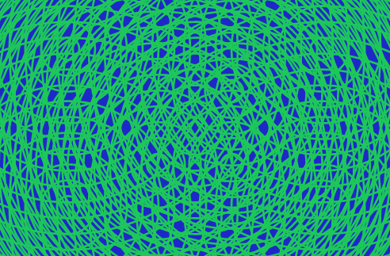
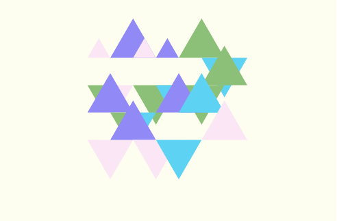
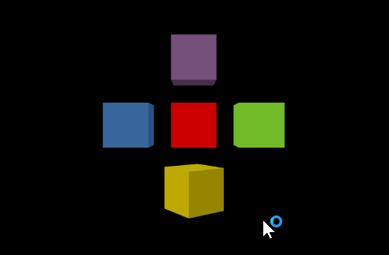

# ElmLive - Codevember Day 1 (2016)

## Following along @avh4 at [youtube](https://www.youtube.com/playlist?list=PLDA4wlOlLJvXAEsJDje4hdLazsihZiQNf)

thanks Aaron!

- [#Codevember on twitter](https://twitter.com/codevember_)
- [Codevember website day 1](http://codevember.xyz/day/1)

making use of [Kwarrtz/render](http://package.elm-lang.org/packages/Kwarrtz/render/latest) SVG render package making use of Random and the Random-extra package

## commands

- `elm-package install Kwarrtz/render`
- `elm-package install elm-community/random-extra`
- `npm install --save-dev elm elm-live` for the watch/make functionality
- `npm run elm-live` to start the server ( or `./node_modules/.bin/elm-live ./day1/Main.elm --open )

# continued day 2

## same repository but now in subfolders

- [elmlive Codevember day 2](https://www.youtube.com/watch?v=OBYVWaAIosM)

  ### result

  

  ## commands

- `npm run live2` to start the server ( or `./node_modules/.bin/elm-live ./day2/Main.elm --open )

# continued day 3

making a Japanese Wave inspired graphic

- [elmlive Codevember day 2](https://www.youtube.com/watch?v=KcXfvS-sl8A)
- 

## commands

- `npm run live3` to start the server ( or `./node_modules/.bin/elm-live ./day3/Main.elm --open )

# continued day 4

Day 4 of Codevember 2016\. We color triangles using the ColourLovers API, and have problems with CORS.

- [elmlive Codevember day 4](https://youtu.be/rE7ozNZkuO0?list=PLDA4wlOlLJvXAEsJDje4hdLazsihZiQNf)
- using this [hsl color picker](http://hslpicker.com/#faffdb)
- NOT using this [ColourLovers API](http://www.colourlovers.com/api) ALAS...
- in particular [pallet, random, json](http://www.colourlovers.com/api/palettes/random?format=json) is copied as local file
- using [color-extra package](http://package.elm-lang.org/packages/eskimoblood/elm-color-extra/latest)
- using [http-server](https://www.npmjs.com/package/http-server) to serve the local colors file (since CORS will not let us use ColourLovers)
- 

## commands

- `elm-package install evancz/elm-http` we will be using Http for first time in Elmlive-Codevember
- `elm-package install eskimoblood/elm-color-extra` for hex helper function
- `npm install http-server -g` for local server
- `npm run color-server` or `http-server -p 8001 --cors` to start the server since CORS does not let us use ColourLovers API!
- `npm run live4` to start the server ( or `./node_modules/.bin/elm-live ./day4/Main.elm --open )

# continued day 5

Day 5 of Codevember 2016\. We make an animated scene with bright colors.

- Cors issues with day4 are corrected by using [crossorigin](http://crossorigin.me/) a free CORS proxy
- Using Max Goldstein's [elm-animation](http://package.elm-lang.org/packages/mgold/elm-animation/latest)
- Using [Easing](http://package.elm-lang.org/packages/elm-community/easing-functions/latest)

## commands

- `elm-package install mgold/elm-animation` for the animation package
- `elm-package install elm-community/easing-functions` for easing
- `npm run live5` to start the server ( or `./node_modules/.bin/elm-live ./day5/Main.elm --open` )

# continued day 6

Day 6 of Codevember 2016\. We learn about WebGL and how to use it with Elm, and also learn how to use elm-webgl correctly to avoid sever performance problems :)

- we are using [WebGL for elm](http://package.elm-lang.org/packages/elm-community/elm-webgl/latest)
- starting by copying the [cube example](https://github.com/elm-community/elm-webgl/blob/master/examples/cube.elm)
- we need the [Fast Linear Algebra for Elm-package](http://package.elm-lang.org/packages/elm-community/elm-linear-algebra/latest)
- and [Getting Smooth Animations package](http://package.elm-lang.org/packages/elm-lang/animation-frame/latest)

 (mine seem to bee turning more than one time 360 degrees...)

## commands

- `elm-package install elm-community/elm-linear-algebra` for the Algebra package
- `elm-package install elm-community/elm-webgl` for WebGL
- `elm-package install elm-lang/animation-frame` for Animation-frame
- `npm run live6` to start the server ( or `./node_modules/.bin/elm-live ./day6/Main.elm --open` )
- next episode : <https://youtu.be/h9w0qmyEnOg>
