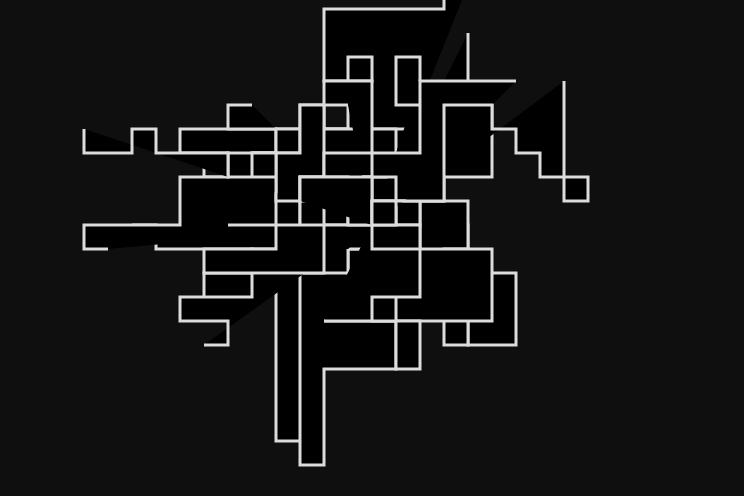
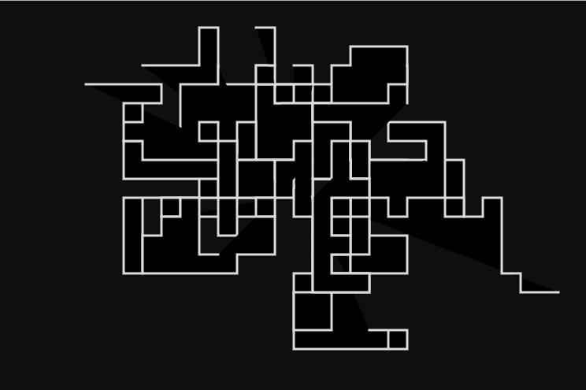

# ElmLive - Codevember Day 1 (2016)

## Following along @avh4 at [youtube](https://www.youtube.com/watch?v=Z0yKvWqkqyE)

thanks Aaron!

- [#Codevember on twitter](https://twitter.com/codevember_)
- [Codevember website day 1](http://codevember.xyz/day/1)

  (image is random rendered on browser refresh)

making use of [Kwarrtz/render](http://package.elm-lang.org/packages/Kwarrtz/render/latest) SVG render package making use of Random and the Random-extra package

## commands

- `elm-package install Kwarrtz/render`
- `elm-package install elm-community/random-extra`
- `npm install --save-dev elm elm-live` for the watch/make functionality
- `npm run elm-live` to start the server ( or `./node_modules/.bin/elm-live ./day1/Main.elm --open )

# continued day 2

## same repository but now in subfolders

- [elmlive Codevember day 2](https://www.youtube.com/watch?v=OBYVWaAIosM)

  ### result

  

  ## commands

- `npm run live2` to start the server ( or `./node_modules/.bin/elm-live ./day2/Main.elm --open )

# continued day 3

making a Japanese Wave inspired graphic

- [elmlive Codevember day 2](https://www.youtube.com/watch?v=KcXfvS-sl8A)
- 

## commands

- `npm run live3` to start the server ( or `./node_modules/.bin/elm-live ./day3/Main.elm --open )
