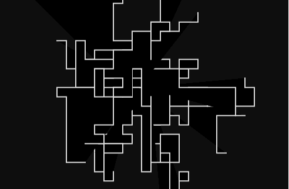
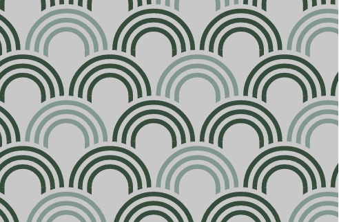
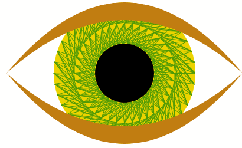
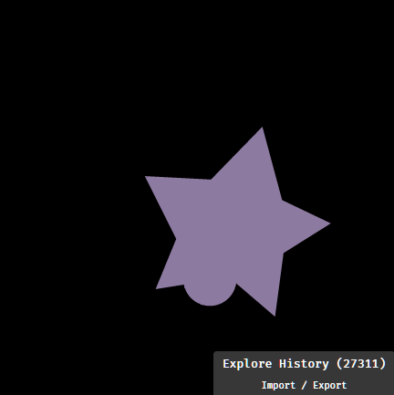

# Elmlive Codevember 2016

## ToC

- [Day 1](#elmlive---codevember-day-1-2016)
- [Day 2](#continued-day-2)
- [Day 3](#continued-day-3)
- [Day 4](#continued-day-4)
- [Day 5](#continued-day-5)
- [Day 6](#continued-day-6)
- [Day 7](#continued-day-7)
- [Day 8](#continued-day-8)
- [Day 9](#continued-day-9)
- [Day 10](#continued-day-10)
- [Day 11](#continued-day-11)
- [Day 12](#continued-day-12)
- [Day 13](#continued-day-13)
- -
- -
- [Day 16](#continued-day-16)
- -
- [Day 18](#continued-day-18)
- [Day 19](#continued-day-19)
- [Day 21](#continued-day-21)
- [Day 22](#Continued-day-22)
- [Day 23](#continued-day-23)
- -
- -
- -
- [Day 27](#continued-day-27)
- [Day 28](#continued-day-28)
- [Day 29](#continued-day-29)
- [Day 30](#continued-day-30)

# ElmLive - Codevember Day 1 (2016)

## Following along @avh4 at [youtube](https://www.youtube.com/playlist?list=PLDA4wlOlLJvXAEsJDje4hdLazsihZiQNf)

thanks Aaron!

- [#Codevember on twitter](https://twitter.com/codevember_)
- [Codevember website day 1](http://codevember.xyz/day/1)

making use of [Kwarrtz/render](http://package.elm-lang.org/packages/Kwarrtz/render/latest) SVG render package making use of Random and the Random-extra package

## commands

- `elm-package install Kwarrtz/render`
- `elm-package install elm-community/random-extra`
- `npm install --save-dev elm elm-live` for the watch/make functionality
- `npm run elm-live` to start the server ( or `./node_modules/.bin/elm-live ./day1/Main.elm --open )

# continued day 2

## same repository but now in subfolders

- [elmlive Codevember day 2](https://www.youtube.com/watch?v=OBYVWaAIosM)

  ### result

  

  ## commands

- `npm run live2` to start the server ( or `./node_modules/.bin/elm-live ./day2/Main.elm --open )

# continued day 3

making a Japanese Wave inspired graphic

- [elmlive Codevember day 2](https://www.youtube.com/watch?v=KcXfvS-sl8A)
- 

## commands

- `npm run live3` to start the server ( or `./node_modules/.bin/elm-live ./day3/Main.elm --open )

# continued day 4

Day 4 of Codevember 2016\. We color triangles using the ColourLovers API, and have problems with CORS.

- [elmlive Codevember day 4](https://youtu.be/rE7ozNZkuO0?list=PLDA4wlOlLJvXAEsJDje4hdLazsihZiQNf)
- using this [hsl color picker](http://hslpicker.com/#faffdb)
- NOT using this [ColourLovers API](http://www.colourlovers.com/api) ALAS...
- in particular [pallet, random, json](http://www.colourlovers.com/api/palettes/random?format=json) is copied as local file
- using [color-extra package](http://package.elm-lang.org/packages/eskimoblood/elm-color-extra/latest)
- using [http-server](https://www.npmjs.com/package/http-server) to serve the local colors file (since CORS will not let us use ColourLovers)
- 

## commands

- `elm-package install evancz/elm-http` we will be using Http for first time in Elmlive-Codevember
- `elm-package install eskimoblood/elm-color-extra` for hex helper function
- `npm install http-server -g` for local server
- `npm run color-server` or `http-server -p 8001 --cors` to start the server since CORS does not let us use ColourLovers API!
- `npm run live4` to start the server ( or `./node_modules/.bin/elm-live ./day4/Main.elm --open )

# continued day 5

Day 5 of Codevember 2016\. We make an animated scene with bright colors.

- Cors issues with day4 are corrected by using [crossorigin](http://crossorigin.me/) a free CORS proxy
- Using Max Goldstein's [elm-animation](http://package.elm-lang.org/packages/mgold/elm-animation/latest)
- Using [Easing](http://package.elm-lang.org/packages/elm-community/easing-functions/latest)

## commands

- `elm-package install mgold/elm-animation` for the animation package
- `elm-package install elm-community/easing-functions` for easing
- `npm run live5` to start the server ( or `./node_modules/.bin/elm-live ./day5/Main.elm --open` )

# continued day 6

Day 6 of Codevember 2016\. We learn about WebGL and how to use it with Elm, and also learn how to use elm-webgl correctly to avoid sever performance problems :)

- we are using [WebGL for elm](http://package.elm-lang.org/packages/elm-community/elm-webgl/latest)
- starting by copying the [cube example](https://github.com/elm-community/elm-webgl/blob/master/examples/cube.elm)
- we need the [Fast Linear Algebra for Elm-package](http://package.elm-lang.org/packages/elm-community/elm-linear-algebra/latest)
- and [Getting Smooth Animations package](http://package.elm-lang.org/packages/elm-lang/animation-frame/latest)

## commands

- `elm-package install elm-community/elm-linear-algebra` for the Algebra package
- `elm-package install elm-community/elm-webgl` for WebGL
- `elm-package install elm-lang/animation-frame` for Animation-frame
- `npm run live6` to start the server ( or `./node_modules/.bin/elm-live ./day6/Main.elm --open` )
- next episode : <https://youtu.be/h9w0qmyEnOg>

# continued day 7

Day 7 of Codevember 2016\. We learn how to write (Phong) lighting shaders and happen upon a pleasing arrangement of cubes.

- Try it: <https://avh4.github.io/codevember-2016/Day7/>
- Code: <https://github.com/avh4/codevember-2016/tree/master/Day7>
- Live streaming on <https://twitch.tv/avh4> recorded at <https://youtu.be/h9w0qmyEnOg?list=PLDA4wlOlLJvXAEsJDje4hdLazsihZiQNf>

Links:

- Codevember <http://codevember.xyz/>
- elm-webgl <http://package.elm-lang.org/packages/elm-community/elm-webgl/latest>
- Learn OpenGL: Basic Lighting tutorial <http://learnopengl.com/#!Lighting/Basic-Lighting>
- glsl-lighting-walkthrough <https://github.com/stackgl/glsl-lighting-walkthrough>

## commands

- `npm run live7` to start elm-live watching ( or `./node_modules/.bin/elm-live ./day7/Main.elm --open` )

# continued day 8

Day 8 of Codevember 2016\. We make a simulation of people crossing the street.

- Try it: <https://avh4.github.io/codevember-2016/Day8/>
- Code: <https://github.com/avh4/codevember-2016/tree/master/Day8>

- Live streaming on <https://twitch.tv/avh4> recorded at <https://www.youtube.com/watch?v=Y6STRt7kI5I&list=PLDA4wlOlLJvXAEsJDje4hdLazsihZiQNf&index=9>

Links:

- Codevember <http://codevember.xyz/>
- Street intersection diagram <https://commons.wikimedia.org/wiki/File:Street_intersection_diagram.svg>

## commands

- `npm run live8` to start elm-live watching ( or `./node_modules/.bin/elm-live ./day8/Main.elm --open` )
- `elm-package install elm-community/random-extra`

# continued day 9

Day 9 of Codevember 2016\. We take a look at a WebGL Elm logo made at the SF Elm Meetup with Carlos.

- The [YouTube recording](https://www.youtube.com/watch?v=ngGtntF3BAQ) is really a quick recap of the coding done during the [Elm hack night meetup in San Fransisco](https://www.youtube.com/watch?v=ngGtntF3BAQ)
- It is a webGL project like Day7 using the Phong-shader, but making the elm-logo this time

## commands

- `npm run live9` to start elm-live watching ( or `./node_modules/.bin/elm-live ./day9/Main.elm --open` )

# continued day 10

Day 10 of Codevember 2016\. We follow a vertex shader tutorial for making slimy broccoli with perlin noise.

- [the elm-live YouTube recording](https://www.youtube.com/watch?v=m4o8-jO1v1w)
- [the Github repository](https://github.com/avh4/codevember-2016/tree/master/Day10)
- Codevember <http://codevember.xyz/>
- [Vertex displacement with a noise function using GLSL](https://www.clicktorelease.com/blog/vertex-displacement-noise-3d-webgl-glsl-three-js)
- ["ClassicNoise3D" Perlin noise algorithm in GLSL](https://github.com/ashima/webgl-noise/blob/master/src/classicnoise3D.glsl)
- [Icosphere mesh algorithm in Haskell](https://github.com/stepcut/icosphere/blob/master/icosphere.hs)
- chroma.js <https://gka.github.io/chroma.js/>
- kfish/elm-shadertoy <https://github.com/kfish/elm-shadertoy>

## commands

- `npm run live10` to start elm-live watching ( or `./node_modules/.bin/elm-live ./day10/Main.elm --open` )

# continued day 11

Day 11 of Codevember 2016\. We publish a new elm package (containing the icosphere mesh we created in Codevember Day 10), and write a fragment shader completely from scratch with no help from tutorials!

- [Try it](https://avh4.github.io/codevember-2016/Day11/)
- [Code from @avh4](https://github.com/avh4/codevember-2016/tree/master/Day11)
- live stream <https://twitch.tv/avh4>
- [Youtube recording](https://www.youtube.com/watch?v=Zlztj90RVAI&index=13&list=PLDA4wlOlLJvXAEsJDje4hdLazsihZiQNf)

There is some hue2rgb and hsl2rgb code in this example making the final image nicer, which is not in the recorded Youtube.

Send Aaron your comments on twitter @avh4\. Thanks for watching and trying out Elm!

Links:

- Codevember <http://codevember.xyz/>
- donate to Trans Lifeline <http://www.translifeline.org/>
- [avh4/elm-meshes (the package we published)](http://package.elm-lang.org/packages/avh4/elm-meshes/latest)
- [glsl-hsl2rgb](https://github.com/Jam3/glsl-hsl2rgb/blob/master/index.glsl)

## commands

- `npm run live11` to start elm-live watching ( or `./node_modules/.bin/elm-live ./day11/Main.elm --open` )

# continued day 12

Day 12 of Codevember 2016\. We make a random art generator generator.

- [Aarons's result](https://avh4.github.io/codevember-2016/Day12/)
- [Aaron's Code](https://github.com/avh4/codevember-2016/tree/master/Day12)
- [streamed on Twitch](https://twitch.tv/avh4)
- [recorded on YouTube](https://www.youtube.com/watch?v=FkBL0xqR_Kc&index=14&list=PLDA4wlOlLJvXAEsJDje4hdLazsihZiQNf)

Send Aaron your comments on twitter @avh4\. Thanks for watching and trying out Elm!

Links:

- Codevember <http://codevember.xyz/>
- At suicide hotlines, the first 24 hours os Trump's America have been full of fear <https://www.washingtonpost.com/news/morning-mix/wp/2016/11/10/at-suicide-hotlines-the-first-24-hours-of-trumps-america-have-been-full-of-fear/>
- National Suicide Prevention Lifeline <http://suicidepreventionlifeline.org/>
- donate to Trans Lifeline <http://www.translifeline.org/>
- This Code is using [elm-graphics](http://package.elm-lang.org/packages/evancz/elm-graphics/latest)
- This Code is using [window](http://package.elm-lang.org/packages/elm-lang/window/latest)

## commands

- `elm-package install evancz/elm-graphics`
- `elm-package install elm-lang/window`
- `npm run live12` to start elm-live watching ( or `./node_modules/.bin/elm-live ./day12/Main.elm --open` )

# continued day 13

Day 13 of Codevember 2016\. (It's weekend!) We combine canvas and WebGL to make animated eyes.

- [Aarons's result](https://avh4.github.io/codevember-2016/Day13/)
- [Aaron's Code](https://github.com/avh4/codevember-2016/tree/master/Day13)
- [streamed on Twitch](https://twitch.tv/avh4)
- [recorded on YouTube](https://www.youtube.com/watch?v=MgkVcBl2kf0&index=15&list=PLDA4wlOlLJvXAEsJDje4hdLazsihZiQNf)

## Links:

- Today's inspiration [one](https://twitter.com/sarah_edo/status/794252476178276352) [two](https://twitter.com/saraislet/status/797358158595248129)
- Codevember <http://codevember.xyz/>
- [Bezier Curve on StackOverflow](https://stackoverflow.com/questions/5634460/quadratic-bezier-curve-calculate-point)

## Elm packages used today:

- <http://package.elm-lang.org/packages/evancz/elm-graphics/latest>
- <http://package.elm-lang.org/packages/mgold/elm-animation/latest>
- <http://package.elm-lang.org/packages/elm-community/easing-functions/latest>
- <http://package.elm-lang.org/packages/elm-community/elm-random-extra/latest>
- <http://package.elm-lang.org/packages/elm-lang/animation-frame/latest>

### Politics links:

- [Supreme Court case Nixon v. Fitzgerald (legal immunity for government officials)](https://en.wikipedia.org/wiki/Nixon_v._Fitzgerald)
- [Clinton v. Jones (setting President has no immunity for acts done before taking office)](https://en.wikipedia.org/wiki/Clinton_v._Jones)
- Summary of lawsuits against Donald Trump [one](https://en.wikipedia.org/wiki/Legal_affairs_of_Donald_Trump) [two](http://www.thedailybeast.com/articles/2016/11/10/75-lawsuits-against-president-elect-trump.html) [three](http://www.politicususa.com/2016/11/01/mainstream-media-ignoring-75-lawsuits-trump-focus-clinton-emails.html) [four](http://www.theatlantic.com/politics/archive/2016/10/donald-trump-scandals/474726/)

- Sexual misconduct allegations against Bill Clinton, Donald Trump, and Warren Buffet - [one](https://en.wikipedia.org/wiki/Bill_Clinton_sexual_misconduct_allegations) [two](https://en.wikipedia.org/wiki/Donald_Trump_sexual_misconduct_allegations) [three](http://nymag.com/thecut/2016/10/all-the-women-accusing-trump-of-rape-sexual-assault.html) [four](http://beforeitsnews.com/alternative/2012/05/human-sacrificing-satanist-bankster-warren-buffet-exposed-2181611.html)

     

## commands

- `elm-package install mdgriffith/elm-color-mixing`
- `npm run live13` to start elm-live watching ( or `./node_modules/.bin/elm-live ./day13/Main.elm --open` )

# continued day 16

Day 16 of Codevember 2016\. (Sorry I could not find Day 14 and Day 15 on YouTube) We use Elm 0.18 for the first time and make an animated bike lane icon with elm-graphics.

- Try it: <https://avh4.github.io/codevember-2016/Day16/>
- Code: <https://github.com/avh4/codevember-2016/tree/master/Day16>
- [streamed on Twitch](https://twitch.tv/avh4)
- [recorded on YouTube](https://www.youtube.com/watch?v=Uj7h7KND1_A&t=14s)
- Send Aaron your comments on twitter @avh4\. Thanks for watching and trying out Elm!

Links:

- Codevember <http://codevember.xyz/>
- using [elm-graphics](http://package.elm-lang.org/packages/evancz/elm-graphics/latest)
- using [animation-frame]{<http://package.elm-lang.org/packages/elm-lang/animation-frame/latest}>

## commands

- install Elm 0.18 from <https://guide.elm-lang.org/install.html>
- run `elm-make` from the folder Day16 to make a new elm-package.json
- `elm-package install evancz/elm-graphics`
- `elm-package install elm-lang/animation-frame`
- `elm-reactor` to check the new debugger functionality in elm 0.18

# Continued Day 18

(Sorry I could not find Day 14, 15 and 17 on YouTube) We make a sunset beach scene with quadratic bezier curves.

- Try it: <https://avh4.github.io/codevember-2016/Day18/>
- Code: <https://github.com/avh4/codevember-2016/tree/master/Day18>
- [streamed on Twitch](https://twitch.tv/avh4)
- [recorded on YouTube](https://www.youtube.com/watch?v=XQupsh_aGvQ)
- Send Aaron your comments on twitter @avh4\. Thanks for watching and trying out Elm!

## Links:

- Codevember <http://codevember.xyz/>
- [elm-graphics](http://package.elm-lang.org/packages/evancz/elm-graphics/latest)
- works with [gradients](http://package.elm-lang.org/packages/elm-lang/core/latest/Color#linear) from color in core
- [Color mixing lib](http://package.elm-lang.org/packages/mdgriffith/elm-color-mixing/latest)
- [AnimationFrame](http://package.elm-lang.org/packages/elm-lang/animation-frame/latest)

## commands

- check for elm 0.18 `elm`
- `elm-package install evancz/elm-graphics`
- `elm-package install mdgriffith/elm-color-mixing`
- `elm-package install elm-lang/animation-frame`
- start with `elm-reactor`

# Continued Day 19

In a late-night edition of ElmLive, we animate an Emily Dickinson poem by candlelight.

- Try it: <https://avh4.github.io/codevember-2016/Day19/>
- Code: <https://github.com/avh4/codevember-2016/tree/master/Day19>
- [streamed on Twitch](https://twitch.tv/avh4)
- [recorded on YouTube](https://www.youtube.com/watch?v=-ymOgRmCk_E)
- Send Aaron your comments on twitter @avh4\. Thanks for watching and trying out Elm!

## Links:

- Codevember <http://codevember.xyz/>
- [Emily Dickinson poems (Project Gutenberg)](http://www.gutenberg.org/cache/epub/12242/pg12242.txt)

## commands

- check for elm 0.18 `elm`
- run with `elm-reactor`

# Continued Day 21

(sorry cannot find Day 20 on YouTube)

We try using mdgriffith/elm-style-animation and run into some problems.

- Try it: <https://avh4.github.io/codevember-2016/Day21/>
- Code: <https://github.com/avh4/codevember-2016/tree/master/Day21>
- [streamed on Twitch](https://twitch.tv/avh4)
- [recorded on YouTube](https://www.youtube.com/watch?v=d-0eFulN8n0)
- Send Aaron your comments on twitter @avh4\. Thanks for watching and trying out Elm!

## Links:

- Codevember <http://codevember.xyz/>
- [Style Animation lib](http://package.elm-lang.org/packages/mdgriffith/elm-style-animation/latest)
- [elm-conf presentation "Rich Animation" by Matthew Griffith](https://www.youtube.com/watch?v=DsDwYqsLU3E) -

## commands

- check for elm 0.18 `elm`
- run `elm-make` once in the folder to create `elm-package.json`
- `elm-package install mdgriffith/elm-style-animation`
- `elm-package install elm-lang/svg`
- run with `elm-reactor`

# Continued Day 22

We parse English sentences and visualize them as trees.

- Try it: <https://avh4.github.io/codevember-2016/Day22/>
- Code: <https://github.com/avh4/codevember-2016/tree/master/Day22>
- [streamed on Twitch](https://twitch.tv/avh4)
- [recorded on YouTube](https://www.youtube.com/watch?v=2svnLZR_DBI)
- Send Aaron your comments on twitter @avh4\. Thanks for watching and trying out Elm!

## Links:

- Codevember <http://codevember.xyz/>
- Our source of sentences <https://www.gutenberg.org/cache/epub/37787/pg37787.txt>
- [elm-combine](http://package.elm-lang.org/packages/Bogdanp/elm-combine/latest)
- [elm-tree-diagram](http://package.elm-lang.org/packages/brenden/elm-tree-diagram/latest)

  

  ## commands

- check for elm 0.18 `elm`

- run `elm-make` once in the folder to create `elm-package.json`

- `elm-package install Bogdanp/elm-combine`

- run with `elm-reactor`

- tree-diagram is a pre 0.18 lib so `git clone https://github.com/brenden/elm-tree-diagram.git`

- change to this directory `cd elm-tree-diagram`

- `npm install -g elm-upgrade`

- run the 0.18 upgrade `elm-upgrade`

- `elm-package install elm-lang/svg`

# Continued Day 23

We make grass grow 😅

- Try it: <https://avh4.github.io/codevember-2016/Day23/>
- Code: <https://github.com/avh4/codevember-2016/tree/master/Day23>
- [streamed on Twitch](https://twitch.tv/avh4)
- [recorded on YouTube](https://www.youtube.com/watch?v=KGQDZucFhtI)
- Send Aaron your comments on twitter @avh4\. Thanks for watching and trying out Elm!

## Links:

- Codevember <http://codevember.xyz/>
- [color-extra for hex calculation](http://package.elm-lang.org/packages/eskimoblood/elm-color-extra/latest)
- [Random colors come from extra](http://package.elm-lang.org/packages/elm-community/random-extra/latest)
- [mixing colors with mdgriffith's lib](http://package.elm-lang.org/packages/mdgriffith/elm-color-mixing/latest)
- [we are going to use the mouse!](http://package.elm-lang.org/packages/elm-lang/mouse/latest)
- [we need the size of the window](http://package.elm-lang.org/packages/elm-lang/window/latest)

## commands

- check for elm 0.18 `elm`
- run `elm-make` once in the folder to create `elm-package.json`
- `elm-package install elm-lang/svg`
- `elm-package install eskimoblood/elm-color-extra`
- `elm-package install elm-lang/animation-frame`
- `elm-package install elm-community/random-extra`
- `elm-package install mdgriffith/elm-color-mixing`
- `elm-package install elm-lang/mouse`
- `elm-package install elm-lang/window`

# Continued Day 24 is missing and Day 25 and 26 are continuation of that project

# Continued Day 27

We exercise our knowledge of vector math and make flipping coins with SVG.

- Try it: <https://avh4.github.io/codevember-2016/Day27/>
- Code: <https://github.com/avh4/codevember-2016/tree/master/Day27>
- [streamed on Twitch](https://twitch.tv/avh4)
- you could use [Livestreamer](http://docs.livestreamer.io/) for that.
- [recorded on YouTube](https://www.youtube.com/watch?v=t1WK3vt_C_c)
- Send Aaron your comments on twitter @avh4\. Thanks for watching and trying out Elm!

## Links:

- Codevember <http://codevember.xyz/>

## Elm packages used today:

- <http://package.elm-lang.org/packages/elm-community/linear-algebra/latest>
- <http://package.elm-lang.org/packages/elm-lang/animation-frame/latest>
- <http://package.elm-lang.org/packages/elm-lang/mouse/latest>
- <http://package.elm-lang.org/packages/elm-lang/svg/latest>
- <http://package.elm-lang.org/packages/elm-lang/window/latest>

## Politics links:

- [Twitter thread about calling your representatives](https://twitter.com/editoremilye/status/797243415922515970)
- [Blog post about CallMyCongress](https://medium.com/@mariechatfield/introducing-callmycongress-com-a-better-way-to-reach-your-representatives-51b86f3e547c)
- [Contact your representatives](http://www.callmycongress.com/)

## commands

- check for elm 0.18 `elm`
- run `elm-make` once in the folder to create `elm-package.json`
- `elm-package install elm-lang/svg`
- `elm-package install elm-lang/mouse`
- `elm-package install elm-community/linear-algebra`
- `elm-package install elm-lang/animation-frame`
- `elm-package install elm-lang/window`

# Continued Day 28

We make turbulent particles with elm-graphics.

- Try it: <https://avh4.github.io/codevember-2016/Day28/>
- Code: <https://github.com/avh4/codevember-2016/tree/master/Day28>
- [streamed on Twitch](https://twitch.tv/avh4)
- you could use [Livestreamer](http://docs.livestreamer.io/) for that.
- [recorded on YouTube](https://youtu.be/90UEBTVAhcE)
- Send Aaron your comments on twitter @avh4\. Thanks for watching and trying out Elm!

## Links:

- Codevember <http://codevember.xyz/>
- Today's inspiration: [Jack Rugile - Simplex Vector Flow Field](https://codepen.io/jackrugile/full/zodPjd)

## commands

- check for elm 0.18 `elm`
- run `elm-make` once in the folder to create `elm-package.json`
- `elm-package install evancz/elm-graphics`
- `elm-package install elm-community/linear-algebra` for the Math.Vector2 package
- `elm-package install elm-lang/animation-frame`

# Continued Day 29

We invent a primitive artificial lifeform.

- Try it: <https://avh4.github.io/codevember-2016/Day29/>
- Code: <https://github.com/avh4/codevember-2016/tree/master/Day29>
- [streamed on Twitch](https://twitch.tv/avh4)
- you could use [Livestreamer](http://docs.livestreamer.io/) for that.
- [recorded on YouTube](https://youtu.be/SwnKZ7Ot0ho)
- Send Aaron your comments on twitter @avh4\. Thanks for watching and trying out Elm!

## Links:

- [Codevember](http://codevember.xyz/)
- [Boids](https://en.wikipedia.org/wiki/Boids)

## commands

- check for elm 0.18 `elm`
- run `elm-make` once in the folder to create `elm-package.json`
- `elm-package install evancz/elm-graphics`
- `elm-package install elm-community/linear-algebra` for the Math.Vector2 package
- `elm-package install elm-lang/animation-frame`

# Continued Day 30

We wrap up Codevember with a simple simulation using the PlanetCute tiles.

- Try it: <https://avh4.github.io/codevember-2016/Day30/>
- Code: <https://github.com/avh4/codevember-2016/tree/master/Day30>
- [streamed on Twitch](https://twitch.tv/avh4)
- you could use [Livestreamer](http://docs.livestreamer.io/) for that.
- [recorded on YouTube](https://youtu.be/s_Tj3I6YKyo)
- Send Aaron your comments on twitter @avh4\. Thanks for watching and trying out Elm!

## Links:

- [Codevember](http://codevember.xyz/)
- [PlanetCute tileset ](http://www.lostgarden.com/2007/05/dancs-miraculously-flexible-game.html)

## commands

- check for elm 0.18 `elm`
- run `elm-make` once in the folder to create `elm-package.json`
