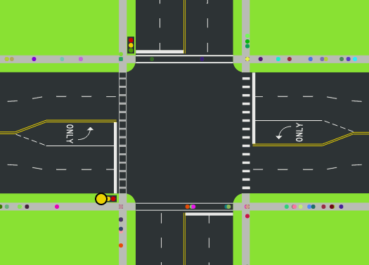
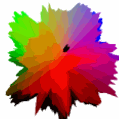

# ElmLive - Codevember Day 1 (2016)

## Following along @avh4 at [youtube](https://www.youtube.com/playlist?list=PLDA4wlOlLJvXAEsJDje4hdLazsihZiQNf)

thanks Aaron!

- [#Codevember on twitter](https://twitter.com/codevember_)
- [Codevember website day 1](http://codevember.xyz/day/1)

making use of [Kwarrtz/render](http://package.elm-lang.org/packages/Kwarrtz/render/latest) SVG render package making use of Random and the Random-extra package

## commands

- `elm-package install Kwarrtz/render`
- `elm-package install elm-community/random-extra`
- `npm install --save-dev elm elm-live` for the watch/make functionality
- `npm run elm-live` to start the server ( or `./node_modules/.bin/elm-live ./day1/Main.elm --open )

# continued day 2

## same repository but now in subfolders

- [elmlive Codevember day 2](https://www.youtube.com/watch?v=OBYVWaAIosM)

  ### result

  

  ## commands

- `npm run live2` to start the server ( or `./node_modules/.bin/elm-live ./day2/Main.elm --open )

# continued day 3

making a Japanese Wave inspired graphic

- [elmlive Codevember day 2](https://www.youtube.com/watch?v=KcXfvS-sl8A)
- 

## commands

- `npm run live3` to start the server ( or `./node_modules/.bin/elm-live ./day3/Main.elm --open )

# continued day 4

Day 4 of Codevember 2016\. We color triangles using the ColourLovers API, and have problems with CORS.

- [elmlive Codevember day 4](https://youtu.be/rE7ozNZkuO0?list=PLDA4wlOlLJvXAEsJDje4hdLazsihZiQNf)
- using this [hsl color picker](http://hslpicker.com/#faffdb)
- NOT using this [ColourLovers API](http://www.colourlovers.com/api) ALAS...
- in particular [pallet, random, json](http://www.colourlovers.com/api/palettes/random?format=json) is copied as local file
- using [color-extra package](http://package.elm-lang.org/packages/eskimoblood/elm-color-extra/latest)
- using [http-server](https://www.npmjs.com/package/http-server) to serve the local colors file (since CORS will not let us use ColourLovers)
- 

## commands

- `elm-package install evancz/elm-http` we will be using Http for first time in Elmlive-Codevember
- `elm-package install eskimoblood/elm-color-extra` for hex helper function
- `npm install http-server -g` for local server
- `npm run color-server` or `http-server -p 8001 --cors` to start the server since CORS does not let us use ColourLovers API!
- `npm run live4` to start the server ( or `./node_modules/.bin/elm-live ./day4/Main.elm --open )

# continued day 5

Day 5 of Codevember 2016\. We make an animated scene with bright colors.

- Cors issues with day4 are corrected by using [crossorigin](http://crossorigin.me/) a free CORS proxy
- Using Max Goldstein's [elm-animation](http://package.elm-lang.org/packages/mgold/elm-animation/latest)
- Using [Easing](http://package.elm-lang.org/packages/elm-community/easing-functions/latest)

## commands

- `elm-package install mgold/elm-animation` for the animation package
- `elm-package install elm-community/easing-functions` for easing
- `npm run live5` to start the server ( or `./node_modules/.bin/elm-live ./day5/Main.elm --open` )

# continued day 6

Day 6 of Codevember 2016\. We learn about WebGL and how to use it with Elm, and also learn how to use elm-webgl correctly to avoid sever performance problems :)

- we are using [WebGL for elm](http://package.elm-lang.org/packages/elm-community/elm-webgl/latest)
- starting by copying the [cube example](https://github.com/elm-community/elm-webgl/blob/master/examples/cube.elm)
- we need the [Fast Linear Algebra for Elm-package](http://package.elm-lang.org/packages/elm-community/elm-linear-algebra/latest)
- and [Getting Smooth Animations package](http://package.elm-lang.org/packages/elm-lang/animation-frame/latest)

## commands

- `elm-package install elm-community/elm-linear-algebra` for the Algebra package
- `elm-package install elm-community/elm-webgl` for WebGL
- `elm-package install elm-lang/animation-frame` for Animation-frame
- `npm run live6` to start the server ( or `./node_modules/.bin/elm-live ./day6/Main.elm --open` )
- next episode : <https://youtu.be/h9w0qmyEnOg>

# continued day 7

Day 7 of Codevember 2016\. We learn how to write (Phong) lighting shaders and happen upon a pleasing arrangement of cubes.

- Try it: <https://avh4.github.io/codevember-2016/Day7/>
- Code: <https://github.com/avh4/codevember-2016/tree/master/Day7>
- Live streaming on <https://twitch.tv/avh4> recorded at <https://youtu.be/h9w0qmyEnOg?list=PLDA4wlOlLJvXAEsJDje4hdLazsihZiQNf>

Links:

- Codevember <http://codevember.xyz/>
- elm-webgl <http://package.elm-lang.org/packages/elm-community/elm-webgl/latest>
- Learn OpenGL: Basic Lighting tutorial <http://learnopengl.com/#!Lighting/Basic-Lighting>
- glsl-lighting-walkthrough <https://github.com/stackgl/glsl-lighting-walkthrough>

## commands

- `npm run live7` to start elm-live watching ( or `./node_modules/.bin/elm-live ./day7/Main.elm --open` )

# continued day 8

Day 8 of Codevember 2016\. We make a simulation of people crossing the street.

- Try it: <https://avh4.github.io/codevember-2016/Day8/>
- Code: <https://github.com/avh4/codevember-2016/tree/master/Day8>

- Live streaming on <https://twitch.tv/avh4> recorded at <https://www.youtube.com/watch?v=Y6STRt7kI5I&list=PLDA4wlOlLJvXAEsJDje4hdLazsihZiQNf&index=9>

Links:

- Codevember <http://codevember.xyz/>
- Street intersection diagram <https://commons.wikimedia.org/wiki/File:Street_intersection_diagram.svg>

## commands

- `npm run live8` to start elm-live watching ( or `./node_modules/.bin/elm-live ./day8/Main.elm --open` )
- `elm-package install elm-community/random-extra`

# continued day 9

Day 9 of Codevember 2016\. We take a look at a WebGL Elm logo made at the SF Elm Meetup with Carlos.

- The [YouTube recording](https://www.youtube.com/watch?v=ngGtntF3BAQ) is really a quick recap of the coding done during the [Elm hack night meetup in San Fransisco](https://www.youtube.com/watch?v=ngGtntF3BAQ)
- It is a webGL project like Day7 using the Phong-shader, but making the elm-logo this time

## commands

- `npm run live9` to start elm-live watching ( or `./node_modules/.bin/elm-live ./day9/Main.elm --open` )

# continued day 10

Day 10 of Codevember 2016\. We follow a vertex shader tutorial for making slimy broccoli with perlin noise.

- [the elm-live YouTube recording](https://www.youtube.com/watch?v=m4o8-jO1v1w)
- [the Github repository](https://github.com/avh4/codevember-2016/tree/master/Day10)
- Codevember <http://codevember.xyz/>
- [Vertex displacement with a noise function using GLSL](https://www.clicktorelease.com/blog/vertex-displacement-noise-3d-webgl-glsl-three-js)
- ["ClassicNoise3D" Perlin noise algorithm in GLSL](https://github.com/ashima/webgl-noise/blob/master/src/classicnoise3D.glsl)
- [Icosphere mesh algorithm in Haskell](https://github.com/stepcut/icosphere/blob/master/icosphere.hs)
- chroma.js <https://gka.github.io/chroma.js/>
- kfish/elm-shadertoy <https://github.com/kfish/elm-shadertoy>

## commands

- `npm run live10` to start elm-live watching ( or `./node_modules/.bin/elm-live ./day10/Main.elm --open` )

# continued day 11

Day 11 of Codevember 2016\. We publish a new elm package (containing the icosphere mesh we created in Codevember Day 10), and write a fragment shader completely from scratch with no help from tutorials!

- [Try it](https://avh4.github.io/codevember-2016/Day11/)
- [Code from @avh4](https://github.com/avh4/codevember-2016/tree/master/Day11)
- live stream <https://twitch.tv/avh4>
- [Youtube recording](https://www.youtube.com/watch?v=Zlztj90RVAI&index=13&list=PLDA4wlOlLJvXAEsJDje4hdLazsihZiQNf)

There is some hue2rgb and hsl2rgb code in this example making the final image nicer, which is not in the recorded Youtube.

Send Aaron your comments on twitter @avh4\. Thanks for watching and trying out Elm!

Links:

- Codevember <http://codevember.xyz/>
- donate to Trans Lifeline <http://www.translifeline.org/>
- [avh4/elm-meshes (the package we published)](http://package.elm-lang.org/packages/avh4/elm-meshes/latest)
- [glsl-hsl2rgb](https://github.com/Jam3/glsl-hsl2rgb/blob/master/index.glsl)

## commands

- `npm run live11` to start elm-live watching ( or `./node_modules/.bin/elm-live ./day11/Main.elm --open` )

# continued day 12

Day 12 of Codevember 2016\. We make a random art generator generator.

- [Aarons's result](https://avh4.github.io/codevember-2016/Day12/)
- [Aaron's Code](https://github.com/avh4/codevember-2016/tree/master/Day12)

Send Aaron your comments on twitter @avh4\. Thanks for watching and trying out Elm!

Links:

- Codevember <http://codevember.xyz/>
- At suicide hotlines, the first 24 hours os Trump's America have been full of fear <https://www.washingtonpost.com/news/morning-mix/wp/2016/11/10/at-suicide-hotlines-the-first-24-hours-of-trumps-america-have-been-full-of-fear/>
- National Suicide Prevention Lifeline <http://suicidepreventionlifeline.org/>
- donate to Trans Lifeline <http://www.translifeline.org/>
- This Code is using [elm-graphics](http://package.elm-lang.org/packages/evancz/elm-graphics/latest)
- - This Code is using [window](http://package.elm-lang.org/packages/elm-lang/window/latest)

## commands

- `elm-package install evancz/elm-graphics`
- `elm-package install elm-lang/window`
- `npm run live12` to start elm-live watching ( or `./node_modules/.bin/elm-live ./day12/Main.elm --open` )
